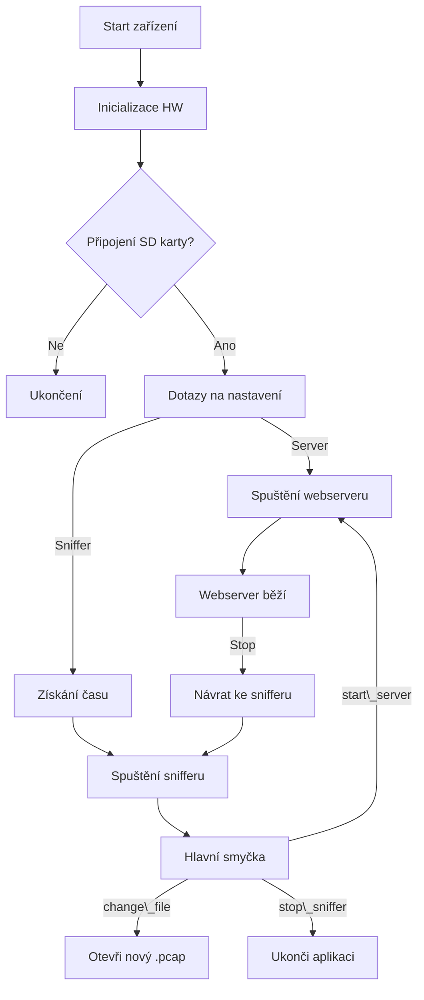

```mermaid
flowchart TD
    Start[Start zařízení] --> InitHW[Inicializace HW]
    InitHW --> MountSD{Připojení SD karty?}
    MountSD -->|Ne| End[Ukončení]
    MountSD -->|Ano| ConfigFlow[Dotazy na nastavení]

    ConfigFlow -->|Server| WebserverPath[Spuštění webserveru]
    ConfigFlow -->|Sniffer| TimeSetup[Získání času]
    TimeSetup --> SnifferStart[Spuštění snifferu]
    WebserverPath --> ServerLoop[Webserver běží]
    ServerLoop -->|Stop| SnifferResume[Návrat ke snifferu]
    SnifferResume --> SnifferStart

    SnifferStart --> MainLoop[Hlavní smyčka]
    MainLoop -->|change\_file| RotateFile[Otevři nový .pcap]
    MainLoop -->|stop\_sniffer| Cleanup[Ukonči aplikaci]
    MainLoop -->|start\_server| WebserverPath
```
